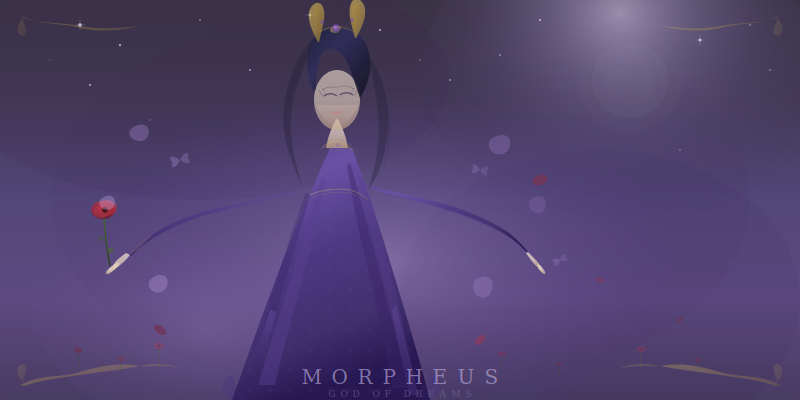

<p align="center">
  
</p>

# Morpheus — Claude Code Plugin

Autonomous skill consolidation modeled on the human sleep cycle.

Tracks how much you use each skill, builds pressure over time, and runs
N1→N2→N3→REM consolidation cycles that scan past conversations, generate
edge-case scenarios, **test patches via subagent eval**, and propose
evidence-backed improvements.

Based on Borbély's two-process model, biological NREM/REM stages, and
Karpathy's autoresearch pattern.

## Install

```
/plugin install https://github.com/youruser/sleep-plugin
```

Or for local development:
```bash
claude --plugin-dir /path/to/sleep-plugin
```

After installing, run `/sleep-status` to confirm it loaded.

## Commands

| Command | Description |
|---------|-------------|
| `/sleep` | Auto-detect pressure, run appropriate cycle |
| `/sleep [skill]` | Target a specific skill |
| `/sleep-status` | Pressure gauges for all tracked skills |
| `/deep-sleep` | Autonomous NEVER STOP overnight mode |
| `/nap [skill]` | Quick N1→N2 triage pass |
| `/dream [skill]` | Standalone dream session on a skill |
| `/snooze` | Defer sleep, accumulate debt |

## How It Works

**Pressure accumulates automatically.** The Stop hook fires after every
conversation, tracking which skills were exercised. A prompt hook
(Haiku) provides semantic relevance — no keyword matching. Pressure
follows a saturating exponential: first conversations after sleep add
the most, later ones diminish.

**Sleep is triggered four ways:**
1. **Slash commands** — `/sleep`, `/deep-sleep`, `/nap`
2. **SessionStart hook** — notifies you when pressure is high
3. **Desktop scheduled task** — nightly autonomous cycles
4. **`/loop`** — intra-session micro-naps every 30 minutes

**The pipeline:**
- **N1 (drift)** — Stochastic scan of past conversations. Grabs fragments with recency bias. Injects synthetic noise.
- **N2 (spindle)** — Classifies fragments as HIT/EDGE/GAP/FRIC/ADJ/NOISE. Most die here (~60%).
- **N3 (consolidate)** — Deep structural audit of the skill. Verifies gaps, measures baseline health, optionally prunes cruft.
- **REM (dream)** — Generates surreal edge-case scenarios via mutation strategies. Runs an **autoresearch-style eval loop**: draft patch → apply to copy → test via subagent → compare with original → regression check → keep or discard. Only evidence-backed patches are proposed.

**Most cycles produce nothing.** Target: ~60% of dreams score 0. If hit
rate is too high, scenarios aren't weird enough.

## Desktop Scheduled Task

For autonomous overnight cycles, create a scheduled task in Claude Code
Desktop:

```
Name: Nightly Sleep Cycle
Schedule: 0 3 * * *
Prompt: Run /deep-sleep
Mode: Auto accept edits
Worktree: enabled
```

## File Structure

```
morpheus/
├── .claude-plugin/plugin.json      Manifest
├── skills/
│   ├── sleep/SKILL.md              /sleep — orchestrator (the program.md)
│   ├── sleep-status/SKILL.md       /sleep-status — pressure gauges
│   ├── deep-sleep/SKILL.md         /deep-sleep — autonomous NEVER STOP
│   ├── nap/SKILL.md                /nap [skill] — quick N1→N2 triage
│   ├── snooze/SKILL.md             /snooze — defer, accumulate debt
│   ├── dream/SKILL.md              /dream [skill] — standalone dreaming
│   ├── drift/SKILL.md              N1 (Claude-only, not user-invocable)
│   ├── spindle/SKILL.md            N2 (Claude-only)
│   └── consolidate/SKILL.md        N3 (Claude-only)
├── hooks/hooks.json                Stop, SessionStart, Setup, SubagentStop
└── scripts/sleep_tracker.py        State I/O (pure math, no intelligence)
```

User-facing skills use `disable-model-invocation: true` so Claude won't
auto-trigger them — you invoke `/sleep` explicitly. Pipeline stages use
`user-invocable: false` since `/spindle` isn't a meaningful user action.

## Hooks

All three Claude Code hook types are used:

- **Command hooks** — State I/O via `sleep_tracker.py`. Fast, deterministic.
- **Prompt hooks** — Semantic relevance assessment via Haiku. Replaces keyword matching.
- **Agent hooks** — Deep verification with tool access (planned for PreCompact).

Most hooks are in `hooks/hooks.json`. Skill-scoped hooks are in frontmatter.

## State

All state lives in `~/.claude/sleep_state.json`. The tracker reads/writes
this file. It's plain JSON — readable by any tool. The tracker itself is
~170 lines of math and I/O with zero intelligence. All reasoning happens
in prompt hooks and subagent evals.

## References

- Borbély (1982). Two-process model of sleep regulation.
- Wamsley et al. (2024). Memory updating in dreams. SLEEP Advances.
- Tononi & Cirelli (2014). Synaptic Homeostasis Hypothesis.
- [karpathy/autoresearch](https://github.com/karpathy/autoresearch) — Eval loop pattern.
